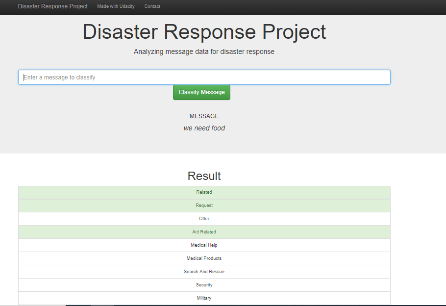
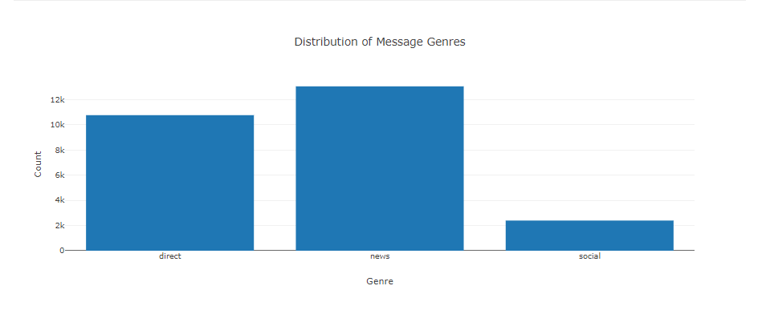
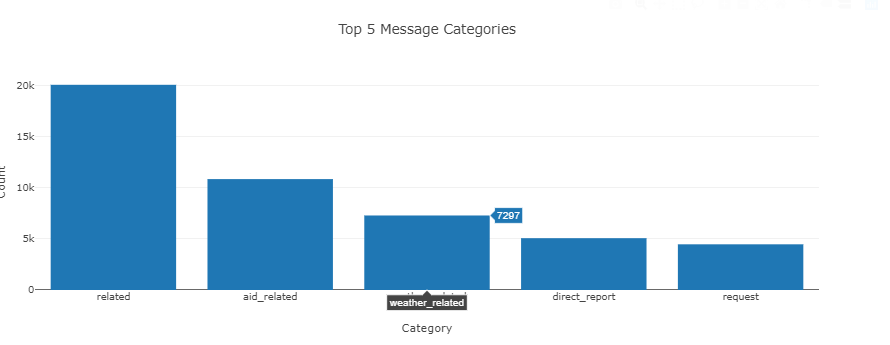

# Disaster Response Pipeline Project

### Summary
Project 6 of Udacity's Data Science Nanodegree. The Disaster Response Pipeline Project aims to built on the data engineering skills and expand the opportunities and potential as a data scientist.

### Instructions:
1. Run the following commands in the project's root directory to set up your database and model.

    - To run ETL pipeline that cleans data and stores in database
        `python data/process_data.py data/disaster_messages.csv data/disaster_categories.csv data/DisasterResponse.db`
    - To run ML pipeline that trains classifier and saves
        `python models/train_classifier.py data/DisasterResponse.db models/classifier.pkl`

2. Run the following command in the app's directory to run your web app.
    `python run.py`

3. Go to http://0.0.0.0:3001/

### Screenshots

 

 

 